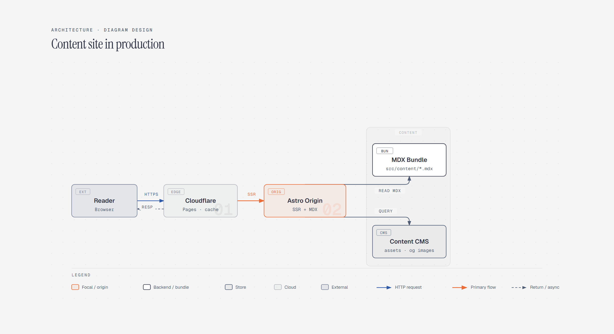

# Architecture Diagram

> System-level architecture: components, connections, and entry points at a glance.

Overview

The **Architecture Diagram** is a self-contained editorial diagram. System-level architecture: components, connections, and entry points at a glance. It ships as a **single-file React component** (inline SVG + Tailwind CSS) with no chart library, no data files, and no external stylesheets — copy the file in and it renders immediately.

Architecture diagram showing reader requests moving through Cloudflare to an Astro origin, MDX bundle, and content CMS.
