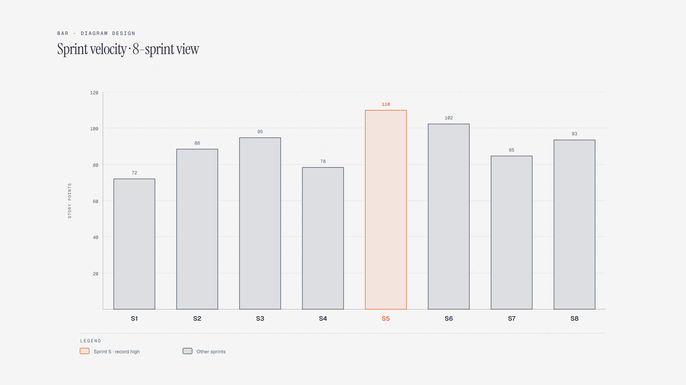

# Bar Chart

> Compare discrete quantities across categories or time intervals.

Overview

The **Bar Chart** is a self-contained editorial diagram. Compare discrete quantities across categories or time intervals. It ships as a **single-file React component** (inline SVG + Tailwind CSS) with no chart library, no data files, and no external stylesheets — copy the file in and it renders immediately.

Bar chart showing story points delivered across sprints S1 through S8, with Sprint 5 as the record high.
