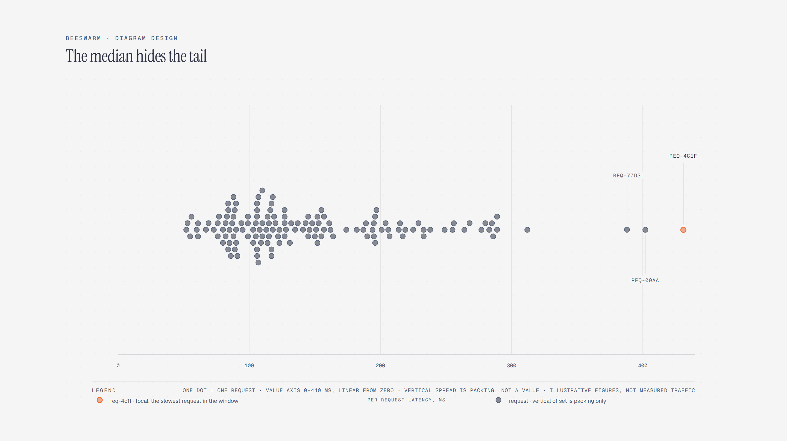

# Beeswarm Plot

> Every data point sits on one shared axis; vertical spread is packing only.

Overview

The **Beeswarm Plot** is a self-contained editorial diagram. Every data point sits on one shared axis; vertical spread is packing only. It ships as a **single-file React component** (inline SVG + Tailwind CSS) with no chart library, no data files, and no external stylesheets — copy the file in and it renders immediately.

Beeswarm of 138 per-request latency samples for one checkout endpoint on a shared linear value axis from zero; vertical spread is packing only and carries no value, and three requests past 380 ms form the p99 tail.
