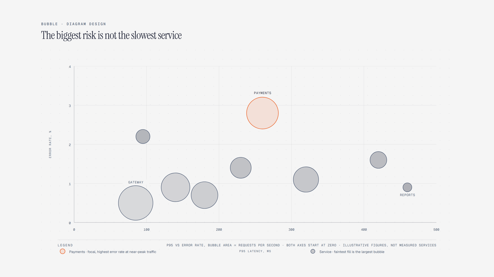

# Bubble Chart

> Three numeric dimensions: x, y, and bubble area.

Overview

The **Bubble Chart** is a self-contained editorial diagram. Three numeric dimensions: x, y, and bubble area. It ships as a **single-file React component** (inline SVG + Tailwind CSS) with no chart library, no data files, and no external stylesheets — copy the file in and it renders immediately.

Bubble chart of nine services by p95 latency and error rate on zero-based axes, bubble area proportional to requests per second; Payments carries near-peak traffic at the highest error rate.
