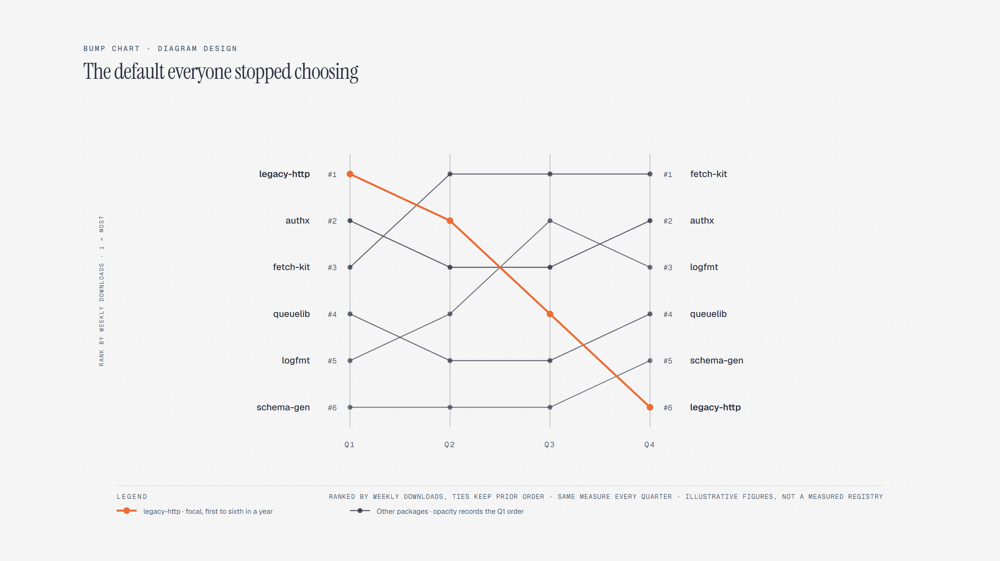

# Bump Chart

> Show rank changes over time.

Overview

The **Bump Chart** is a self-contained editorial diagram. Show rank changes over time. It ships as a **single-file React component** (inline SVG + Tailwind CSS) with no chart library, no data files, and no external stylesheets — copy the file in and it renders immediately.

Bump chart ranking six internal packages by weekly downloads across four quarters; legacy-http slides from first to sixth while fetch-kit takes the top rank in the second quarter and keeps it.
