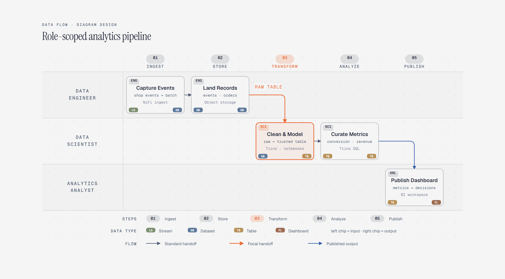

# Data Flow Diagram

> Role-scoped analytics pipeline.

Overview

The **Data Flow Diagram** is a self-contained editorial diagram. Role-scoped analytics pipeline. It ships as a **single-file React component** (inline SVG + Tailwind CSS) with no chart library, no data files, and no external stylesheets — copy the file in and it renders immediately.

A Data Engineer ingests and stores commerce data, a Data Scientist transforms and analyzes it, and an Analyst publishes a dashboard.
