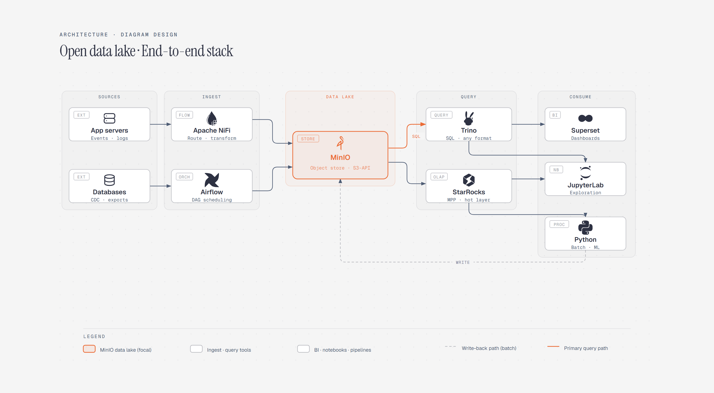

# Data Lake Architecture

> End-to-end open data lake stack.

Overview

The **Data Lake Architecture** is a self-contained editorial diagram. End-to-end open data lake stack. It ships as a **single-file React component** (inline SVG + Tailwind CSS) with no chart library, no data files, and no external stylesheets — copy the file in and it renders immediately.

Data lake architecture showing app servers and databases flowing through Apache NiFi into MinIO, then Trino, StarRocks, Superset, JupyterLab, and Python.
