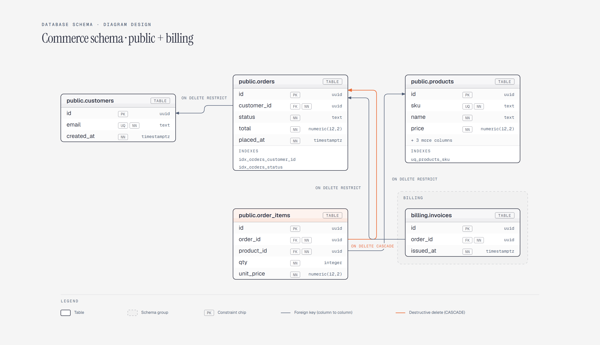

# Database Schema Diagram

> Tables, columns, foreign keys, and constraints.

Overview

The **Database Schema Diagram** is a self-contained editorial diagram. Tables, columns, foreign keys, and constraints. It ships as a **single-file React component** (inline SVG + Tailwind CSS) with no chart library, no data files, and no external stylesheets — copy the file in and it renders immediately.

Physical database schema diagram showing five commerce tables with column-level foreign keys, SQL types, and constraint chips, including a cascading delete from orders into order_items and a billing schema group.
