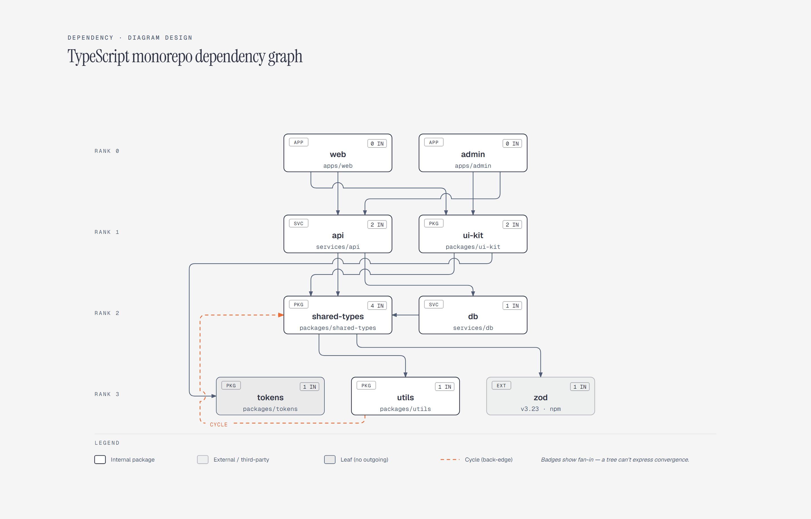

# Dependency Graph

> Module dependency ranking with fan-in and cycles.

Overview

The **Dependency Graph** is a self-contained editorial diagram. Module dependency ranking with fan-in and cycles. It ships as a **single-file React component** (inline SVG + Tailwind CSS) with no chart library, no data files, and no external stylesheets — copy the file in and it renders immediately.

Ranked dependency graph of a TypeScript monorepo showing shared-types as the highest fan-in package with four dependents, and one back-edge cycle from utils into shared-types.
