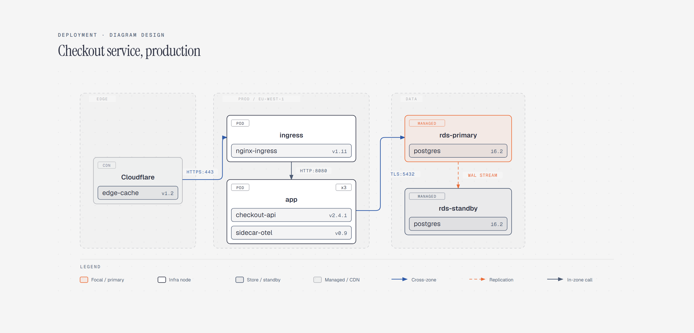

# Deployment Diagram

> Where each service runs: edge, cluster, and data zones.

Overview

The **Deployment Diagram** is a self-contained editorial diagram. Where each service runs: edge, cluster, and data zones. It ships as a **single-file React component** (inline SVG + Tailwind CSS) with no chart library, no data files, and no external stylesheets — copy the file in and it renders immediately.

Deployment diagram placing the checkout service across an edge CDN zone, a production Kubernetes zone running ingress and API pods, and a data zone with a primary Postgres instance replicating to a standby.
