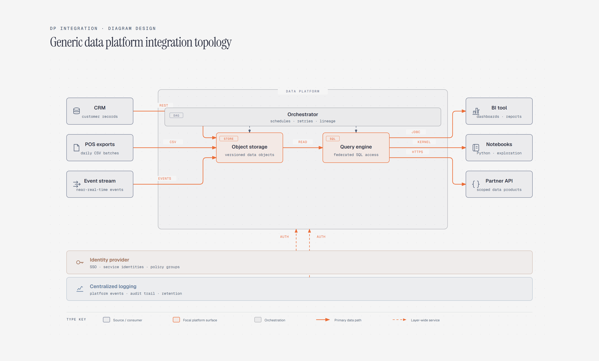

# Data Platform Integration

> Integration topology for a generic data platform.



## Overview

The **Data Platform Integration** is a self-contained editorial diagram. Integration topology for a generic data platform. It ships as a **single-file React component** (inline SVG + Tailwind CSS) with no chart library, no data files, and no external stylesheets — copy the file in and it renders immediately.

Integration topology showing CRM, POS exports, and an event stream landing in object storage for query, notebooks, dashboards, and a partner API.

## When to use it

- Data platform documentation
- Architecture reviews and integration guides
- Vendor onboarding material

## Tech stack

| Layer | Technology | Role |
| ----- | ---------- | ---- |
| UI | **React 18+** | Function component with hooks, no classes |
| Types | **TypeScript 5+** | Typed props for safe, self-documenting usage |
| Styling | **Tailwind CSS** | Layout only, on the wrapper element |
| Graphics | **Inline SVG** | The entire diagram is hand-authored SVG |

## File anatomy

- `DataPlatformIntegration.tsx` — the whole diagram in one file:

  1. **Font loading** — a `useEffect` injects the editorial font stack
     (Geist, Geist Mono, Instrument Serif) into the page once. It is idempotent,
     so rendering many diagrams never duplicates the stylesheet link.
  2. **Wrapper** — a `<div>` with Tailwind utilities (`w-full max-w-4xl mx-auto`)
     and a `data-diagram="dp-integration"` attribute. Pass your own `className` to
     override sizing.
  3. **The SVG** — one `<svg viewBox="0 0 1200 664">` containing every element of the
     diagram. `dp-integration-title` / `dp-integration-desc` provide accessible names.
  4. **Scoped CSS** — this diagram relies on CSS classes inside the
     SVG, so the component injects a small scoped stylesheet
     (`dd-dp-integration`-prefixed selectors) in the same effect. It cannot
     collide with your own styles.

## Visual layers

Reading the SVG top to bottom:

- Side nodes for sources and consumers with tabler icons
- Core object-storage node in accent tint
- Connector lines styled by type (primary / trigger / auth)
- Footer bands for source and consumer groups

Uses inline icon defs (currentColor) plus scoped CSS classes.

## Props

| Prop        | Type     | Default                          | Description                       |
| ----------- | -------- | -------------------------------- | --------------------------------- |
| `className` | `string` | `"w-full max-w-4xl mx-auto"`     | Extra classes for the wrapper div |

## Usage

```tsx
   import DataPlatformIntegration from "./components/DataPlatformIntegration";

   export function Dashboard() {
     return <DataPlatformIntegration className="w-full max-w-4xl mx-auto" />;
   }
   
```

## Customization

- **Sizing** — override `className` to control the wrapper width and margins.
- **Colors** — the scoped stylesheet defines CSS custom properties (`--paper`, `--ink`, `--accent`, …) that you can redefine to match your brand.
- **Content** — the SVG is hand-authored; edit labels and geometry directly in the JSX to reflect your own data.

## Accessibility

- `role="img"` with an `aria-labelledby` title + description
- Text inside the SVG is real text, not images — screen-reader friendly
- Focus-safe: no interactive elements, safe to embed anywhere

## Browser support

Runs anywhere React 18+ runs — Chrome, Firefox, Safari, Edge. No WebGL, no canvas,
no network requests beyond the one-time Google Fonts stylesheet.

## Notes

- **Responsive** — the SVG scales to its container width via the `viewBox`;
  control size with `className` (`max-w-*`, `w-full`, etc.).
- **Fonts** — Geist / Geist Mono / Instrument Serif are loaded from Google
  Fonts automatically. Offline, they fall back to `system-ui` / `monospace`
  without breaking the layout.
- **Duplicates** — rendering the same component twice on one page repeats
  internal SVG ids (`dp-integration-title`, patterns). Visual output is unaffected;
  only a11y tooling sees duplicated ids.
- **Tailwind optional** — the diagram itself is styled by SVG presentation
  attributes, so it renders even in a project without Tailwind; only the
  wrapper's utility classes need Tailwind.

## Credits

Adapted from [cathrynlavery/diagram-design](https://github.com/cathrynlavery/diagram-design)
(MIT License).
