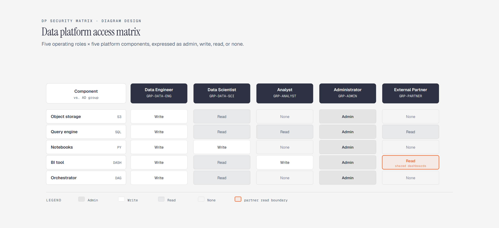

# Access / Permission Matrix

> Role x component access at a glance.

Overview

The **Access / Permission Matrix** is a self-contained editorial diagram. Role x component access at a glance. It ships as a **single-file React component** (inline SVG + Tailwind CSS) with no chart library, no data files, and no external stylesheets — copy the file in and it renders immediately.

A five by five permission matrix for platform roles and components.
