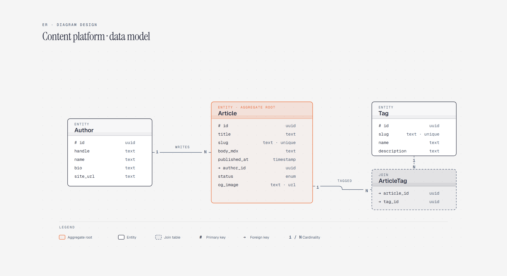

# Entity-Relationship Diagram

> Entities and their relationships.

Overview

The **Entity-Relationship Diagram** is a self-contained editorial diagram. Entities and their relationships. It ships as a **single-file React component** (inline SVG + Tailwind CSS) with no chart library, no data files, and no external stylesheets — copy the file in and it renders immediately.

Entity-relationship diagram showing authors writing articles and articles connecting to tags and categories.
