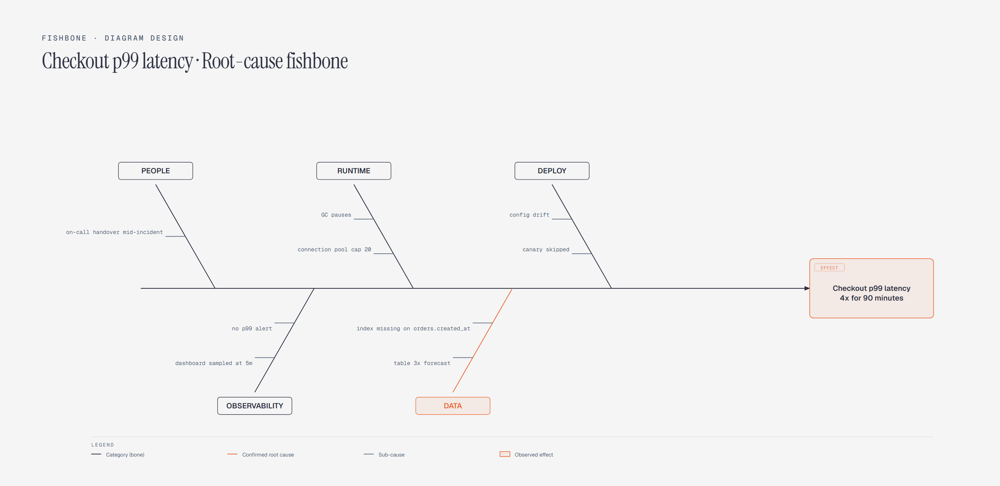

# Fishbone (Ishikawa) Diagram

> Root-cause analysis across cause categories.

Overview

The **Fishbone (Ishikawa) Diagram** is a self-contained editorial diagram. Root-cause analysis across cause categories. It ships as a **single-file React component** (inline SVG + Tailwind CSS) with no chart library, no data files, and no external stylesheets — copy the file in and it renders immediately.

Fishbone diagram tracing a checkout latency incident to five candidate cause categories, with a missing database index under Data confirmed as the root cause.
