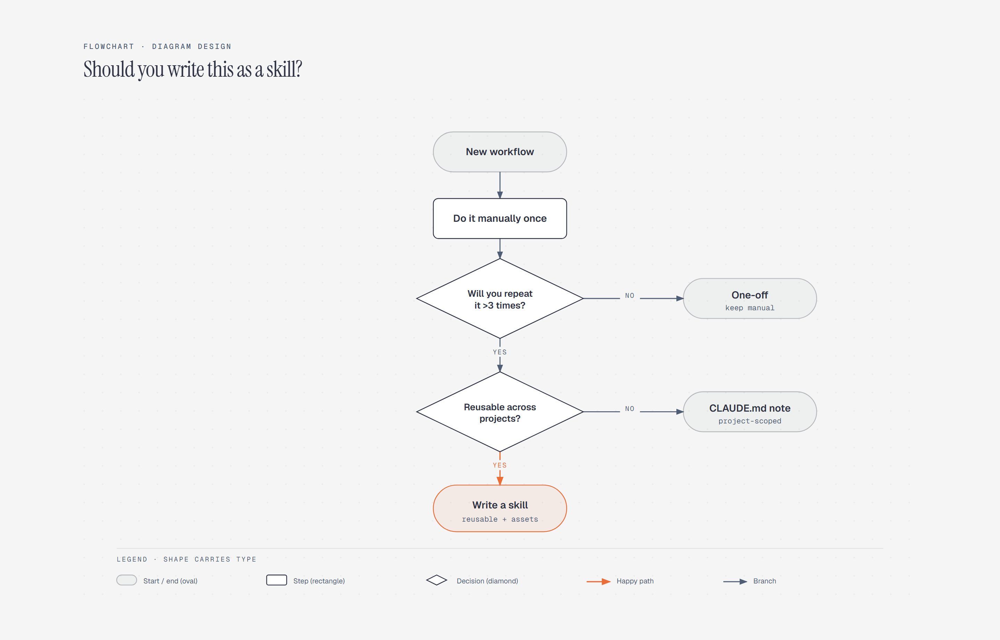

# Flowchart

> Decisions, branches, and outcomes.

Overview

The **Flowchart** is a self-contained editorial diagram. Decisions, branches, and outcomes. It ships as a **single-file React component** (inline SVG + Tailwind CSS) with no chart library, no data files, and no external stylesheets — copy the file in and it renders immediately.

Flowchart showing when a new workflow should stay manual, become a project note, or be written as a reusable skill.
