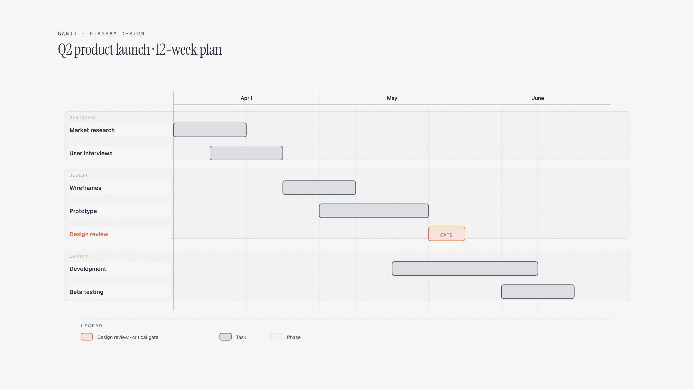

# Gantt Chart

> Work items on a shared schedule.

Overview

The **Gantt Chart** is a self-contained editorial diagram. Work items on a shared schedule. It ships as a **single-file React component** (inline SVG + Tailwind CSS) with no chart library, no data files, and no external stylesheets — copy the file in and it renders immediately.

Gantt chart showing a twelve-week product launch from market research and interviews through design review, development, beta testing, and launch.
