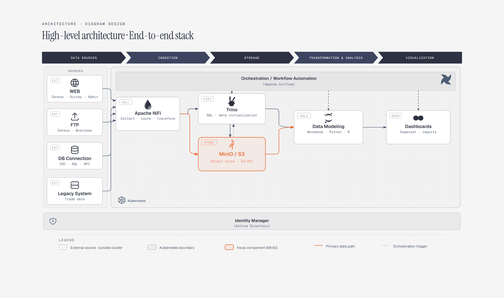

# High-Level Architecture

> End-to-end stack overview in one banded diagram.

Overview

The **High-Level Architecture** is a self-contained editorial diagram. End-to-end stack overview in one banded diagram. It ships as a **single-file React component** (inline SVG + Tailwind CSS) with no chart library, no data files, and no external stylesheets — copy the file in and it renders immediately.

Architecture diagram showing data sources moving through Apache NiFi and MinIO into Trino, data modeling, and Superset dashboards, with Airflow orchestration.
