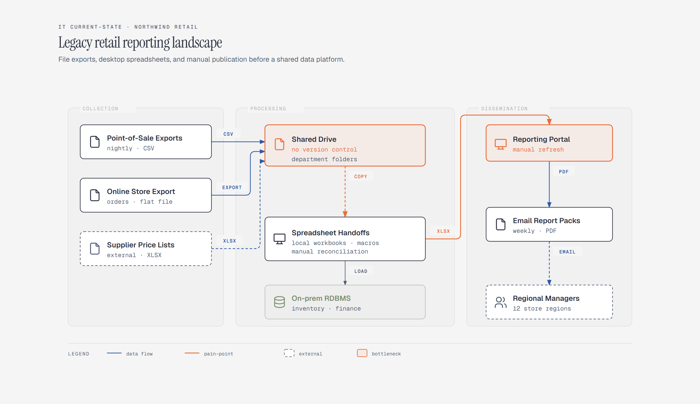

# IT Landscape / Current-State Map

> What systems exist today, and how they hand off.

Overview

The **IT Landscape / Current-State Map** is a self-contained editorial diagram. What systems exist today, and how they hand off. It ships as a **single-file React component** (inline SVG + Tailwind CSS) with no chart library, no data files, and no external stylesheets — copy the file in and it renders immediately.

Three zones show collection, processing, and dissemination through manual file handoffs.
