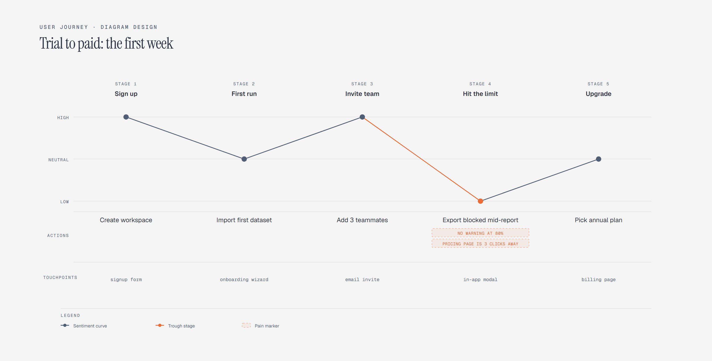

# User Journey Map

> Stages, actions, touchpoints, and sentiment.

Overview

The **User Journey Map** is a self-contained editorial diagram. Stages, actions, touchpoints, and sentiment. It ships as a **single-file React component** (inline SVG + Tailwind CSS) with no chart library, no data files, and no external stylesheets — copy the file in and it renders immediately.

User journey map of a new trial user across five stages, showing actions, touchpoints, and a sentiment curve that dips at the usage-limit stage before recovering at upgrade.
