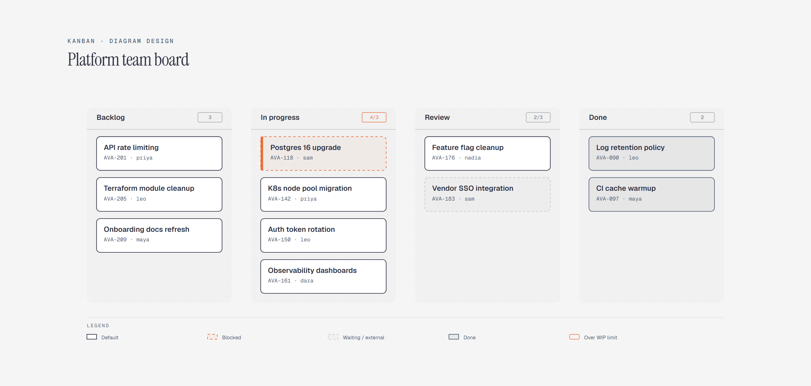

# Kanban Board

> Work in progress across columns, with WIP limits.

Overview

The **Kanban Board** is a self-contained editorial diagram. Work in progress across columns, with WIP limits. It ships as a **single-file React component** (inline SVG + Tailwind CSS) with no chart library, no data files, and no external stylesheets — copy the file in and it renders immediately.

Kanban board showing a platform team's work-in-progress across backlog, in-progress, review, and done columns, with the in-progress column over its WIP limit and one blocked card awaiting a vendor maintenance window.
