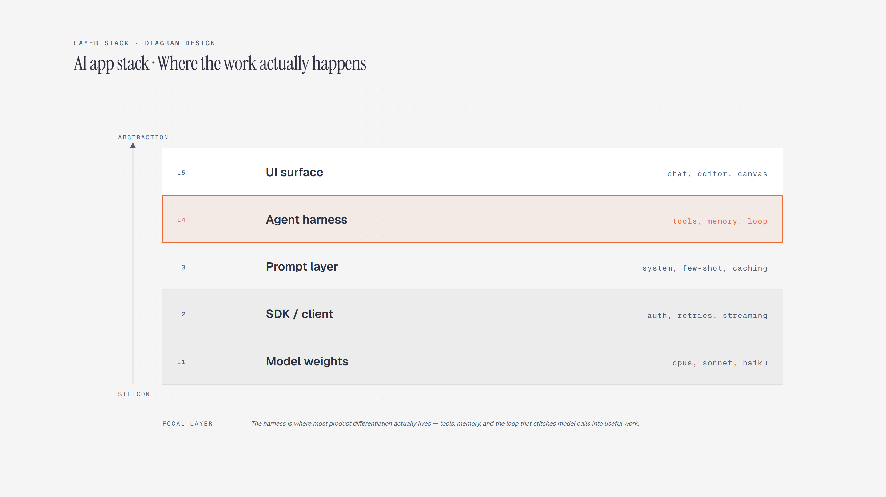

# Layered Stack

> Stack layers with one focal layer.

Overview

The **Layered Stack** is a self-contained editorial diagram. Stack layers with one focal layer. It ships as a **single-file React component** (inline SVG + Tailwind CSS) with no chart library, no data files, and no external stylesheets — copy the file in and it renders immediately.

Layer stack showing model weights, SDK, prompts, agent harness, and UI surface, with the agent harness highlighted as the focal layer.
