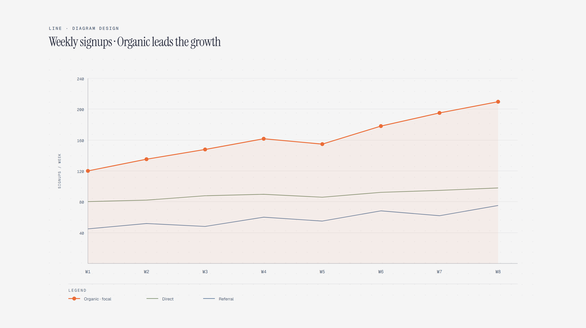

# Line Chart

> Trends over time across series.

Overview

The **Line Chart** is a self-contained editorial diagram. Trends over time across series. It ships as a **single-file React component** (inline SVG + Tailwind CSS) with no chart library, no data files, and no external stylesheets — copy the file in and it renders immediately.

Line chart showing weekly signups from organic, direct, and referral channels across weeks W1 through W8.
