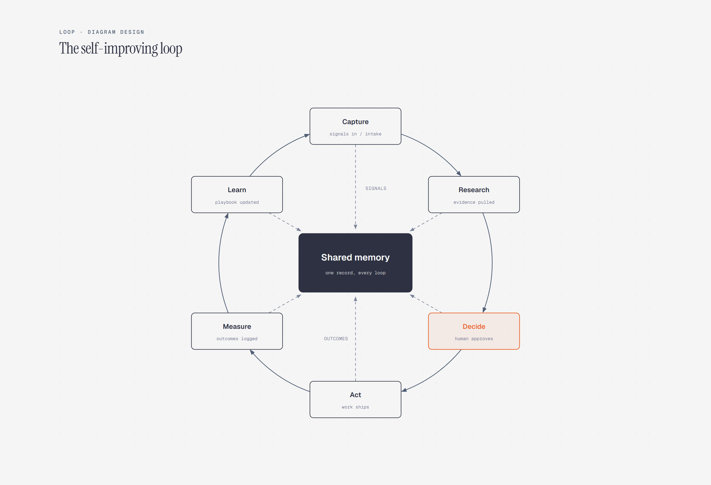

# Loop / Cycle Diagram

> A cyclic process with a central shared state.

Overview

The **Loop / Cycle Diagram** is a self-contained editorial diagram. A cyclic process with a central shared state. It ships as a **single-file React component** (inline SVG + Tailwind CSS) with no chart library, no data files, and no external stylesheets — copy the file in and it renders immediately.

Six stations flow clockwise from Capture through Learn and back to Capture. Each station writes shared state into one central memory hub, with Decide highlighted as the human approval gate.
