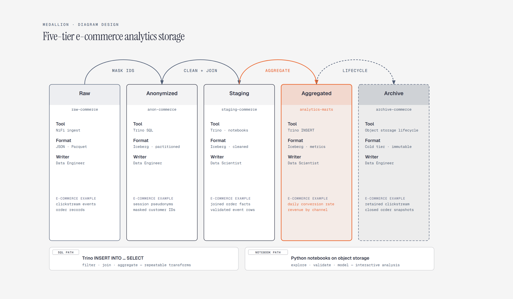

# Medallion Architecture

> Raw to refined data tiers.

Overview

The **Medallion Architecture** is a self-contained editorial diagram. Raw to refined data tiers. It ships as a **single-file React component** (inline SVG + Tailwind CSS) with no chart library, no data files, and no external stylesheets — copy the file in and it renders immediately.

Clickstream events and order records move from raw storage through anonymized, staging, and aggregated tiers before lifecycle archiving.
