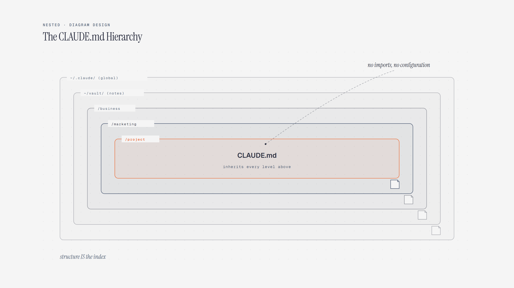

# Nested Containers

> Hierarchy as nested boxes.

Overview

The **Nested Containers** is a self-contained editorial diagram. Hierarchy as nested boxes. It ships as a **single-file React component** (inline SVG + Tailwind CSS) with no chart library, no data files, and no external stylesheets — copy the file in and it renders immediately.

Nested diagram showing how project CLAUDE.md instructions inherit broader scopes from the global, vault, business, and marketing levels.
