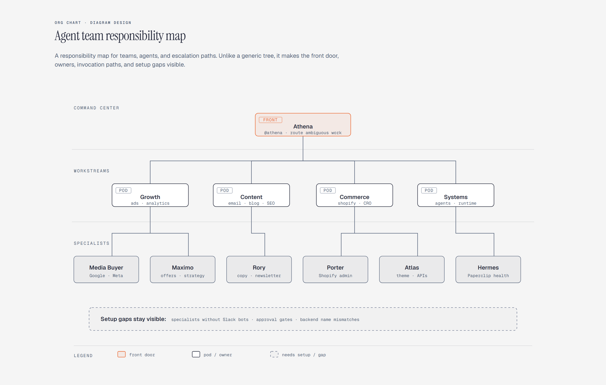

# Org Chart

> Reporting and routing structure.

Overview

The **Org Chart** is a self-contained editorial diagram. Reporting and routing structure. It ships as a **single-file React component** (inline SVG + Tailwind CSS) with no chart library, no data files, and no external stylesheets — copy the file in and it renders immediately.

Org chart showing a command center routing work to specialist agents and escalation owners.
