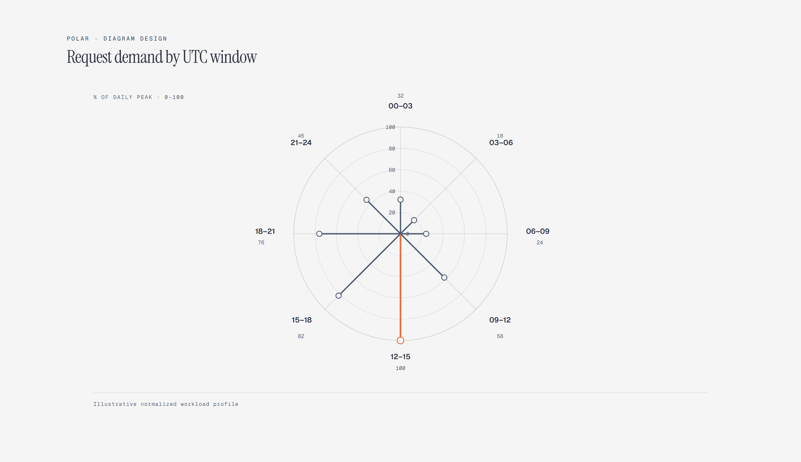

# Polar Chart

> Radial categories on a percentage scale.

Overview

The **Polar Chart** is a self-contained editorial diagram. Radial categories on a percentage scale. It ships as a **single-file React component** (inline SVG + Tailwind CSS) with no chart library, no data files, and no external stylesheets — copy the file in and it renders immediately.

Polar chart on a 0-100% scale identifying 12-15 UTC as the 100% peak, with the other seven UTC windows proceeding clockwise.
