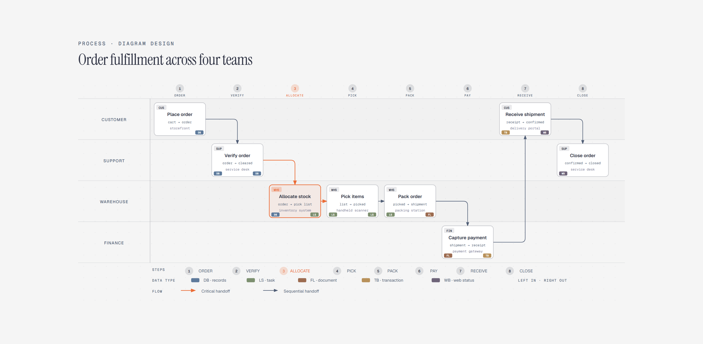

# Process Diagram

> A process across owning teams.

Overview

The **Process Diagram** is a self-contained editorial diagram. A process across owning teams. It ships as a **single-file React component** (inline SVG + Tailwind CSS) with no chart library, no data files, and no external stylesheets — copy the file in and it renders immediately.

Process diagram showing an order moving through customer, support, warehouse, and finance ownership from placement to close.
