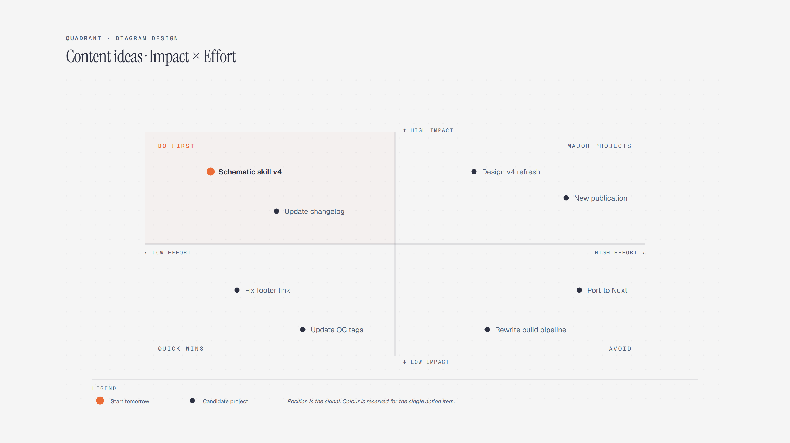

# Quadrant Matrix

> 2x2 prioritization.

Overview

The **Quadrant Matrix** is a self-contained editorial diagram. 2x2 prioritization. It ships as a **single-file React component** (inline SVG + Tailwind CSS) with no chart library, no data files, and no external stylesheets — copy the file in and it renders immediately.

Impact-effort matrix showing eight content projects across do first, major projects, quick wins, and avoid quadrants.
