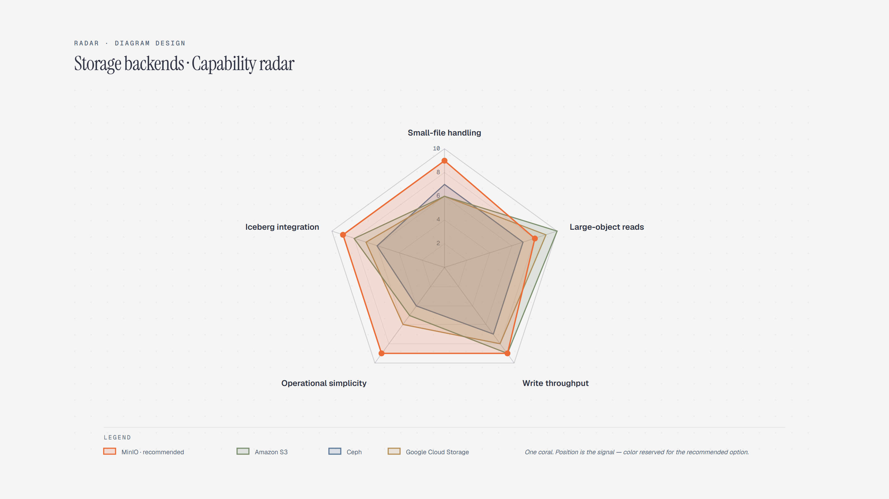

# Radar Chart

> Multi-dimensional capability comparison.

Overview

The **Radar Chart** is a self-contained editorial diagram. Multi-dimensional capability comparison. It ships as a **single-file React component** (inline SVG + Tailwind CSS) with no chart library, no data files, and no external stylesheets — copy the file in and it renders immediately.

Radar chart comparing MinIO, Amazon S3, Ceph, and Google Cloud Storage across five storage capabilities.
