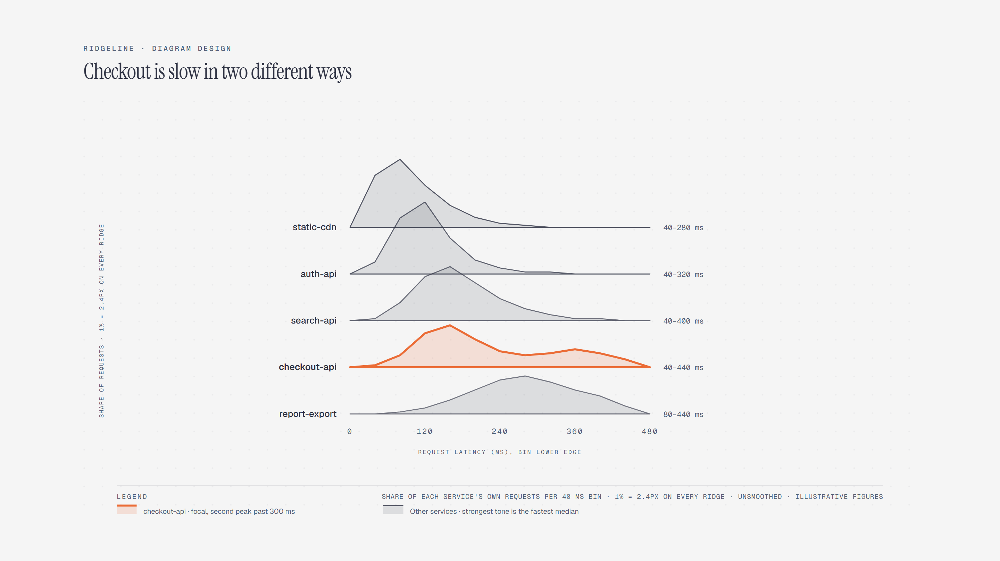

# Ridgeline Plot

> Distributions side by side on one shared amplitude scale.

Overview

The **Ridgeline Plot** is a self-contained editorial diagram. Distributions side by side on one shared amplitude scale. It ships as a **single-file React component** (inline SVG + Tailwind CSS) with no chart library, no data files, and no external stylesheets — copy the file in and it renders immediately.

Ridgeline chart of request-latency distributions for five services over one week; each ridge is the share of that service's requests falling in 40-millisecond bins, drawn on one shared amplitude scale, and checkout-api carries a second peak past 300 milliseconds that none of the other four show.
