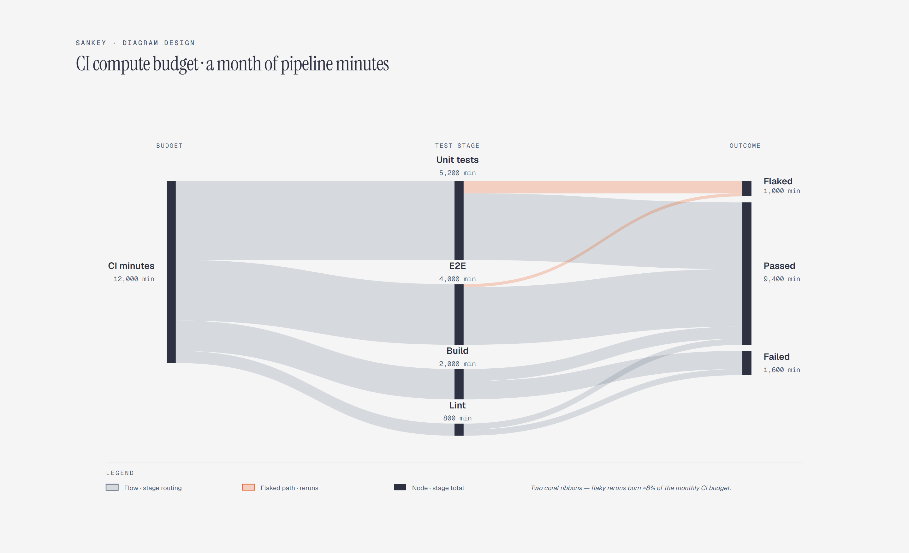

# Sankey Diagram

> Flow volume splits and merges.

Overview

The **Sankey Diagram** is a self-contained editorial diagram. Flow volume splits and merges. It ships as a **single-file React component** (inline SVG + Tailwind CSS) with no chart library, no data files, and no external stylesheets — copy the file in and it renders immediately.

Sankey diagram showing 12,000 monthly CI minutes splitting into unit test, E2E, build, and lint stages, then merging into passed, failed, and flaked outcomes, with the flaky-rerun path highlighted as the one accent flow.
