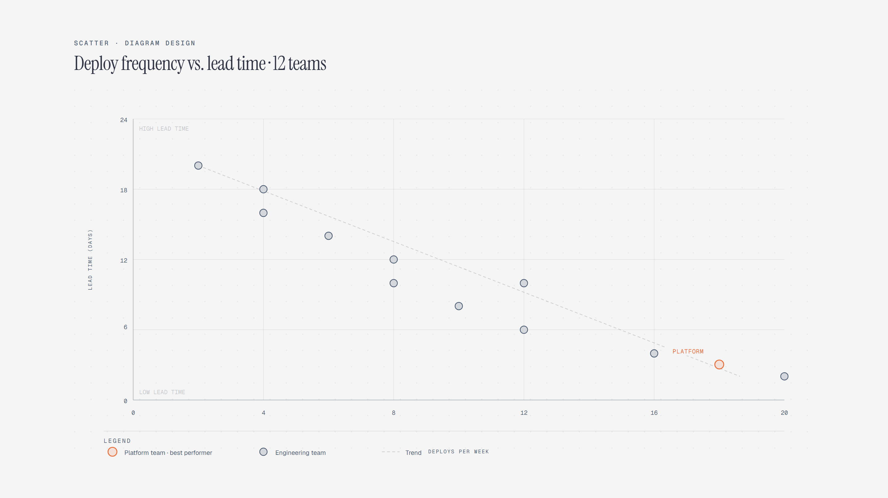

# Scatter Plot

> Two metrics per entity, quadrant read.

Overview

The **Scatter Plot** is a self-contained editorial diagram. Two metrics per entity, quadrant read. It ships as a **single-file React component** (inline SVG + Tailwind CSS) with no chart library, no data files, and no external stylesheets — copy the file in and it renders immediately.

Scatter plot showing twelve engineering teams by deploy frequency and lead time, with Platform in the best-performing quadrant.
