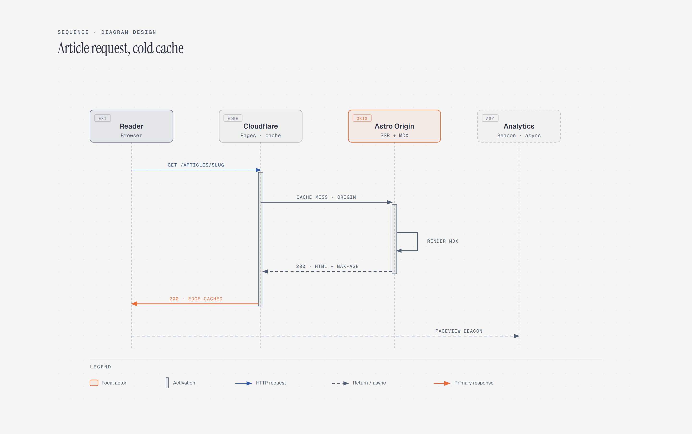

# Sequence Diagram

> Message order between participants.

Overview

The **Sequence Diagram** is a self-contained editorial diagram. Message order between participants. It ships as a **single-file React component** (inline SVG + Tailwind CSS) with no chart library, no data files, and no external stylesheets — copy the file in and it renders immediately.

Sequence diagram showing a cold-cache article request moving from reader and browser through Cloudflare to an Astro origin and analytics beacon.
