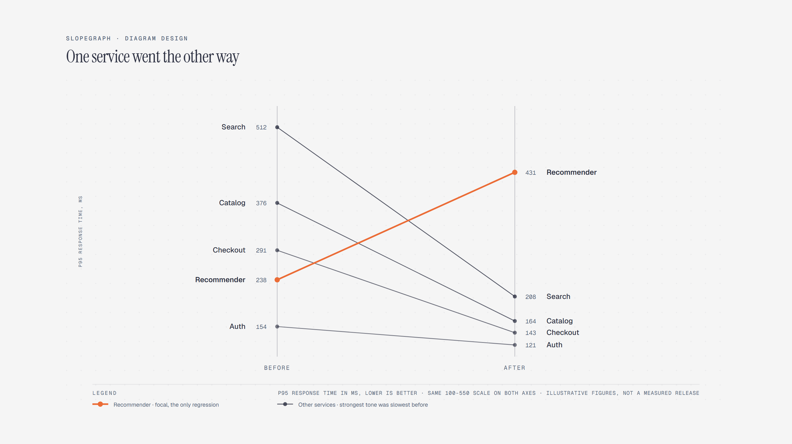

# Slopegraph

> Before / after per category on one shared scale.

Overview

The **Slopegraph** is a self-contained editorial diagram. Before / after per category on one shared scale. It ships as a **single-file React component** (inline SVG + Tailwind CSS) with no chart library, no data files, and no external stylesheets — copy the file in and it renders immediately.

Slopegraph of p95 response time by service before and after a caching layer, on one shared 100-to-550-millisecond scale; four services got faster and the recommender got slower, crossing three of them.
