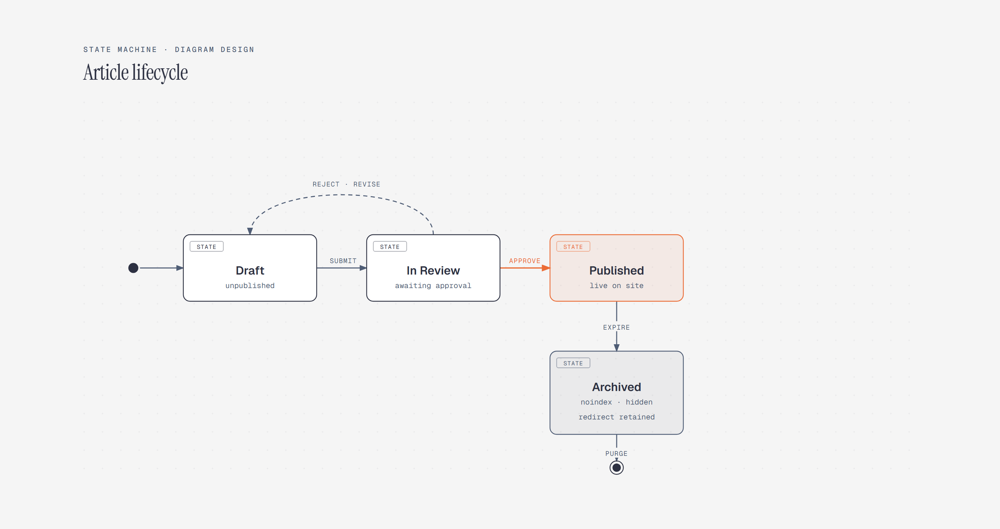

# State Machine

> States, transitions, rejection and revision.

Overview

The **State Machine** is a self-contained editorial diagram. States, transitions, rejection and revision. It ships as a **single-file React component** (inline SVG + Tailwind CSS) with no chart library, no data files, and no external stylesheets — copy the file in and it renders immediately.

State machine showing an article moving from Draft through In Review and Published to Archived, including rejection and revision.
