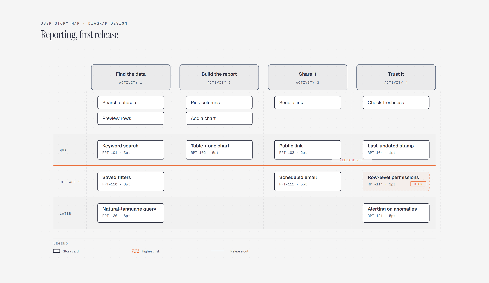

# User Story Map

> Activities, steps, and release slices.

Overview

The **User Story Map** is a self-contained editorial diagram. Activities, steps, and release slices. It ships as a **single-file React component** (inline SVG + Tailwind CSS) with no chart library, no data files, and no external stylesheets — copy the file in and it renders immediately.

User story map for a reporting tool's first release: four narrative activities from finding data to trusting it, walking-skeleton steps beneath each, and three release slices sliced by an MVP release-cut line, with the row-level-permissions story flagged as the riskiest bet in Release 2.
