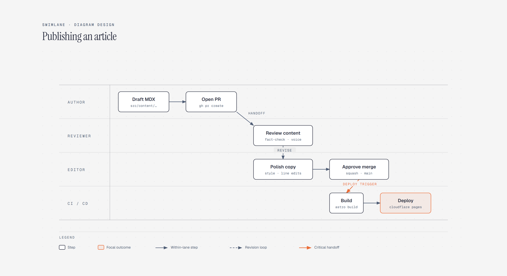

# Swimlane Diagram

> A workflow across roles.

Overview

The **Swimlane Diagram** is a self-contained editorial diagram. A workflow across roles. It ships as a **single-file React component** (inline SVG + Tailwind CSS) with no chart library, no data files, and no external stylesheets — copy the file in and it renders immediately.

Swimlane diagram showing an article moving from MDX draft through review, editing, approval, build, and Cloudflare Pages deployment.
