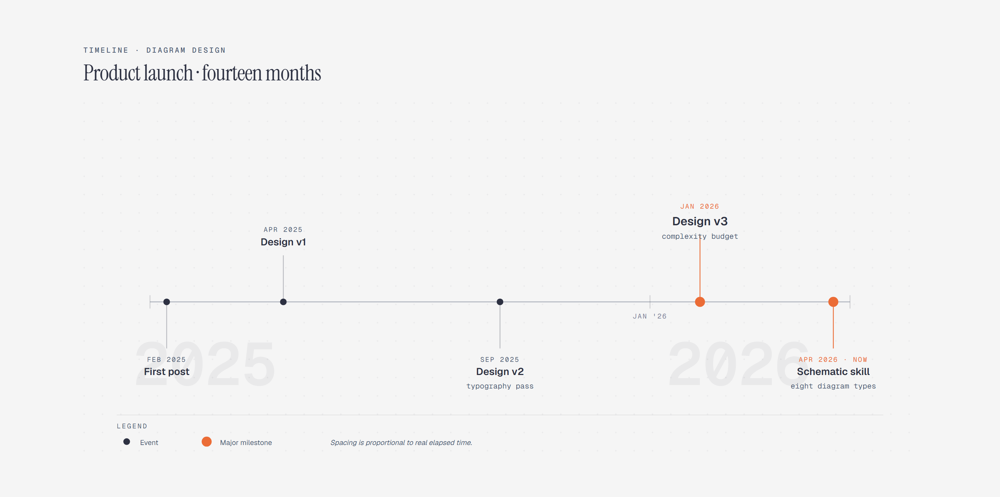

# Timeline

> Milestones in chronological order.

Overview

The **Timeline** is a self-contained editorial diagram. Milestones in chronological order. It ships as a **single-file React component** (inline SVG + Tailwind CSS) with no chart library, no data files, and no external stylesheets — copy the file in and it renders immediately.

Timeline showing product milestones from the first post in February 2025 through three design versions and the schematic skill in April 2026.
