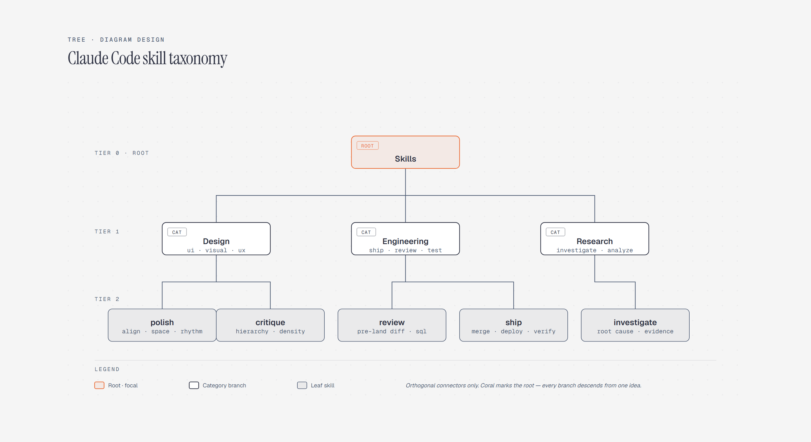

# Tree Diagram

> A taxonomy that branches.

Overview

The **Tree Diagram** is a self-contained editorial diagram. A taxonomy that branches. It ships as a **single-file React component** (inline SVG + Tailwind CSS) with no chart library, no data files, and no external stylesheets — copy the file in and it renders immediately.

Tree diagram showing a Skills root branching into Design, Engineering, and Research categories and their leaf skills.
