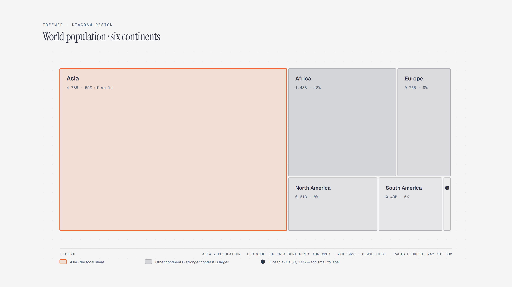

# Treemap

> Area is the value; hierarchy is the nesting.



Overview

The **Treemap** is a self-contained editorial diagram. Area is the value; hierarchy is the nesting. It ships as a **single-file React component** (inline SVG + Tailwind CSS) with no chart library, no data files, and no external stylesheets — copy the file in and it renders immediately.

Treemap of world population by continent in mid-2023, where cell area is population; Asia holds about 59 percent of the world total and Oceania, at under one percent, is too small to label.


## When to use it

- Budget and portfolio allocation
- Market share and population breakdowns
- Any area-as-value hierarchical split


## Tech stack

| Layer | Technology | Role |
| ----- | ---------- | ---- |
| UI | **React 18+** | Function component with hooks, no classes |
| Types | **TypeScript 5+** | Typed props for safe, self-documenting usage |
| Styling | **Tailwind CSS** | Layout only, on the wrapper element |
| Graphics | **Inline SVG** | The entire diagram is hand-authored SVG |


## File anatomy

- `Treemap.tsx` — the whole diagram in one file:

  1. **Font loading** — a `useEffect` injects the editorial font stack
     (Geist, Geist Mono, Instrument Serif) into the page once. It is idempotent,
     so rendering many diagrams never duplicates the stylesheet link.
  2. **Wrapper** — a `<div>` with Tailwind utilities (`w-full max-w-4xl mx-auto`)
     and a `data-diagram="treemap"` attribute. Pass your own `className` to
     override sizing.
  3. **The SVG** — one `<svg viewBox="0 0 1000 500">` containing every element of the
     diagram. `treemap-title` / `treemap-desc` provide accessible names.


## Visual layers

Reading the SVG top to bottom:

- Top-level cells whose area is the value
- Nested sub-cells where the hierarchy continues
- Labels inside cells that have room
- A note for the too-small-to-label cell

If a cell is too small to label, say so in the caption instead of forcing text.


## Props

| Prop        | Type     | Default                          | Description                       |
| ----------- | -------- | -------------------------------- | --------------------------------- |
| `className` | `string` | `"w-full max-w-4xl mx-auto"`     | Extra classes for the wrapper div |


## Usage

```tsx
   import Treemap from "./components/Treemap";

   export function Dashboard() {
     return <Treemap className="w-full max-w-4xl mx-auto" />;
   }
   
```
