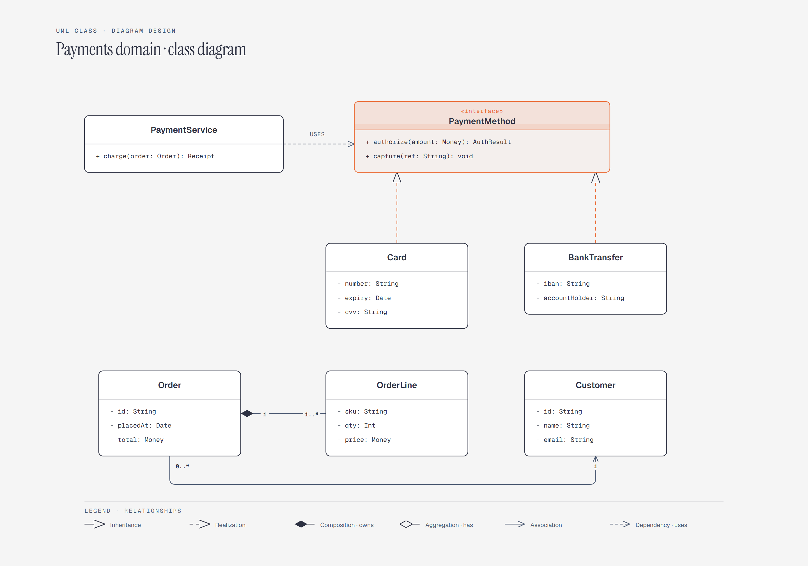

# UML Class Diagram

> Classes, interfaces, and relations.

Overview

The **UML Class Diagram** is a self-contained editorial diagram. Classes, interfaces, and relations. It ships as a **single-file React component** (inline SVG + Tailwind CSS) with no chart library, no data files, and no external stylesheets — copy the file in and it renders immediately.

Class diagram showing Card and BankTransfer realizing a PaymentMethod interface, PaymentService depending on PaymentMethod, and Order composed of OrderLine while associated with Customer.

## When to use it

- Domain-modeling documentation
- API and service design docs
- Codebase onboarding for a payments domain
