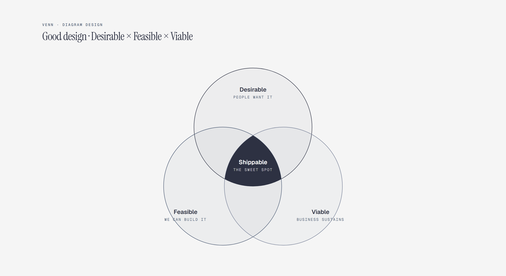

# Venn Diagram

> Set intersections.



Overview

The **Venn Diagram** is a self-contained editorial diagram. Set intersections. It ships as a **single-file React component** (inline SVG + Tailwind CSS) with no chart library, no data files, and no external stylesheets — copy the file in and it renders immediately.

Venn diagram showing desirable, feasible, and viable product qualities intersecting at shippable.


## When to use it

- Positioning and requirement triage
- Concept and product-explainer docs
- Any three-set intersection story


## Tech stack

| Layer | Technology | Role |
| ----- | ---------- | ---- |
| UI | **React 18+** | Function component with hooks, no classes |
| Types | **TypeScript 5+** | Typed props for safe, self-documenting usage |
| Styling | **Tailwind CSS** | Layout only, on the wrapper element |
| Graphics | **Inline SVG** | The entire diagram is hand-authored SVG |


## File anatomy

- `VennDiagram.tsx` — the whole diagram in one file:

  1. **Font loading** — a `useEffect` injects the editorial font stack
     (Geist, Geist Mono, Instrument Serif) into the page once. It is idempotent,
     so rendering many diagrams never duplicates the stylesheet link.
  2. **Wrapper** — a `<div>` with Tailwind utilities (`w-full max-w-4xl mx-auto`)
     and a `data-diagram="venn"` attribute. Pass your own `className` to
     override sizing.
  3. **The SVG** — one `<svg viewBox="0 0 1000 480">` containing every element of the
     diagram. `venn-title` / `venn-desc` provide accessible names.


## Visual layers

Reading the SVG top to bottom:

- Three circles in a classic overlap
- Set labels at the rim
- The center intersection labeled
- Accent on the intersection that matters

Three circles is the ceiling; more sets belong in a matrix.


## Props

| Prop        | Type     | Default                          | Description                       |
| ----------- | -------- | -------------------------------- | --------------------------------- |
| `className` | `string` | `"w-full max-w-4xl mx-auto"`     | Extra classes for the wrapper div |


## Usage

```tsx
   import VennDiagram from "./components/VennDiagram";

   export function Dashboard() {
     return <VennDiagram className="w-full max-w-4xl mx-auto" />;
   }
   
```
