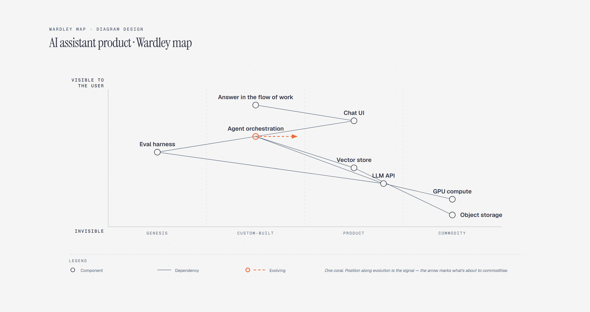

# Wardley Map

> Value chain vs. evolution.



Overview

The **Wardley Map** is a self-contained editorial diagram. Value chain vs. evolution. It ships as a **single-file React component** (inline SVG + Tailwind CSS) with no chart library, no data files, and no external stylesheets — copy the file in and it renders immediately.

Wardley map plotting an AI assistant product's value chain from the user-facing need down to raw infrastructure against genesis-to-commodity evolution, with agent orchestration commoditising toward the product band.


## When to use it

- Strategy and positioning documentation
- Platform evolution planning
- Build vs. buy narratives


## Tech stack

| Layer | Technology | Role |
| ----- | ---------- | ---- |
| UI | **React 18+** | Function component with hooks, no classes |
| Types | **TypeScript 5+** | Typed props for safe, self-documenting usage |
| Styling | **Tailwind CSS** | Layout only, on the wrapper element |
| Graphics | **Inline SVG** | The entire diagram is hand-authored SVG |


## File anatomy

- `WardleyMap.tsx` — the whole diagram in one file:

  1. **Font loading** — a `useEffect` injects the editorial font stack
     (Geist, Geist Mono, Instrument Serif) into the page once. It is idempotent,
     so rendering many diagrams never duplicates the stylesheet link.
  2. **Wrapper** — a `<div>` with Tailwind utilities (`w-full max-w-4xl mx-auto`)
     and a `data-diagram="wardley"` attribute. Pass your own `className` to
     override sizing.
  3. **The SVG** — one `<svg viewBox="0 0 1000 460">` containing every element of the
     diagram. `wardley-title` / `wardley-desc` provide accessible names.


## Visual layers

Reading the SVG top to bottom:

- Value-chain nodes from user need down to infrastructure
- An evolution axis from genesis to commodity
- Component bands marking stages of maturity
- The commoditising component highlighted in accent

The x-axis is evolution, not time — keep the labels honest.


## Props

| Prop        | Type     | Default                          | Description                       |
| ----------- | -------- | -------------------------------- | --------------------------------- |
| `className` | `string` | `"w-full max-w-4xl mx-auto"`     | Extra classes for the wrapper div |


## Usage

```tsx
   import WardleyMap from "./components/WardleyMap";

   export function Dashboard() {
     return <WardleyMap className="w-full max-w-4xl mx-auto" />;
   }
   
```


## Customization

- **Sizing** — override `className` to control the wrapper width and margins.
- **Colors** — edit the SVG `fill` / `stroke` presentation attributes directly to match your brand palette.
- **Content** — the SVG is hand-authored; edit labels and geometry directly in the JSX to reflect your own data.


## Accessibility

- `role="img"` with an `aria-labelledby` title + description
- Text inside the SVG is real text, not images — screen-reader friendly
- Focus-safe: no interactive elements, safe to embed anywhere
