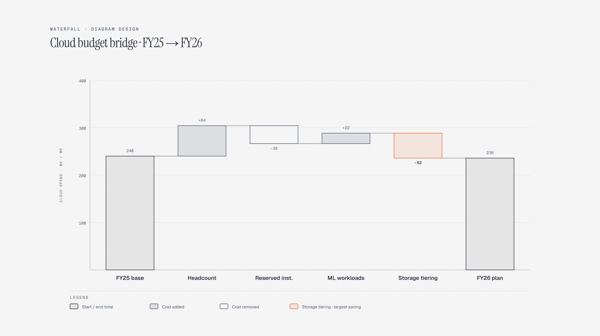

# Waterfall Chart

> A running-total bridge between two numbers.

Overview

The **Waterfall Chart** is a self-contained editorial diagram. A running-total bridge between two numbers. It ships as a **single-file React component** (inline SVG + Tailwind CSS) with no chart library, no data files, and no external stylesheets — copy the file in and it renders immediately.

Waterfall chart bridging the FY25 cloud budget of 240 thousand dollars a month to the FY26 plan of 236, through headcount growth, reserved-instance savings, new ML workloads, and storage tiering - the largest saving.
