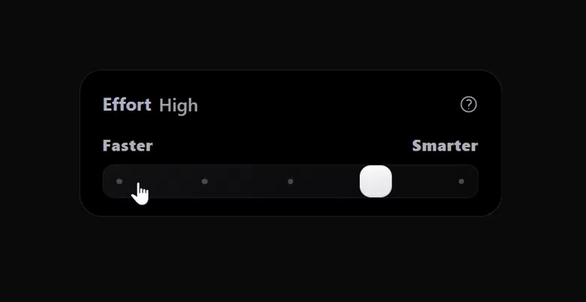

# Claude Range Slider

An effort-level range slider with a real-time WebGL2 fire animation, rebuilt in React and TypeScript. When the slider reaches its maximum ("Ultracode"), a GPU-rendered flame ignites along the track and the status label flips up into view.

This is a React + TypeScript + Tailwind CSS reimplementation inspired by the effort-level slider UI found in Claude Code by [Anthropic](https://www.anthropic.com).

---

Demo

---
