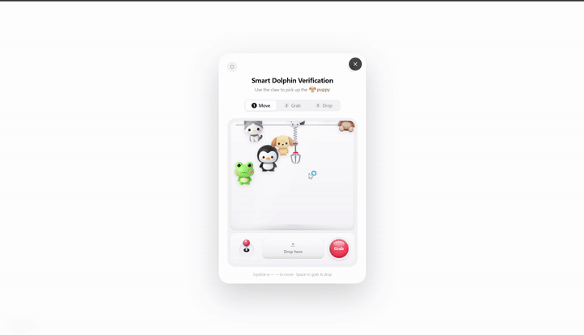

# Smart Dolphin Verification

Smart Dolphin Verification is a reusable human-verification package combining a PlayCaptcha claw-machine interaction with an ALTCHA proof-of-work backend check.

[Download the MP4 demo](./public/demo.mp4)

The visual layer stays playful, while the backend performs signed challenge verification, expiration checks, rate limiting and one-time replay protection.

Features

- Minimal white demo page with a single login button
- Reusable React verification component
- Reusable TypeScript SDK
- Go backend reference API
- Redis-backed rate limiting and replay prevention
- Fully English user interface
